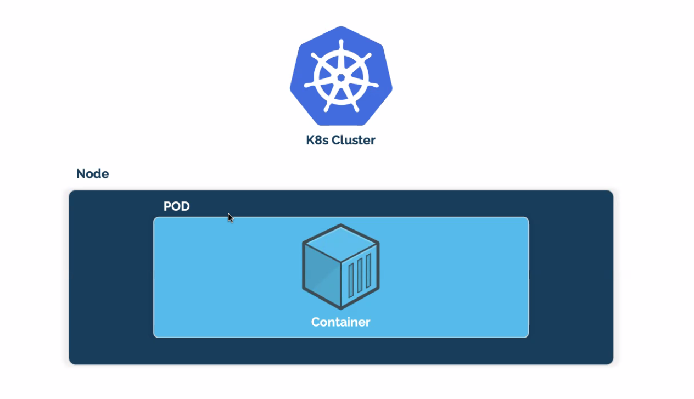

# KUBERNETES-On-AWS
This is my main kubernetes project repo

## Component that made up the Kubernetes
Kubernetes (K8s) - is an open-source system for automating deployment, scaling and management of containerized
applications. (managing containers at scale N)

When you deploy Kubernetes, you get a cluster.

Kubernetes cluster is a group of one or more worker node consists of a set of worker machines, called nodes,that run containerized application.

Worker node(s) host the PODS (containerized app). They are just Server i.e EC2 server 

Control Plane (Master) manages the worker nodes and the pods in the cluster.

# KUBERNETES ARCHITECTURE  

## CONTROL PLANE(MASTER)
This is the brain of kubernetes. He's responsible of sCheduling containers on the worker node. He's the guy that give direction (`ORCHESTRATION`) to each worker node. 

`ON THE MASTER WE HAVE`
1. API SERVER : It's that component in the control plane that allow or manages the comminication between the worker node and the control plane 

2. ETCD (DISTRIBUTED STORAGE): As the is a communication between the Master and the Worker node there are some information that are send between them and need to be store. 
ETCD is just where the contole store all information about the cluster. 

  * This storage is a `key value storage`. It's a Json file. 

3. SCHEDULER: It's just that component that allow the Master to know exactly where to schedule a container. He is responsible of assigning a conatiner to a node. 

  * when a worker node died, K8s will create a new one. And that new worker node doesn't conatian any POPs on it. So, the Scheduler will schedule some pops/conatiners to the new worker node. 

4. REPLICATION CONTROLLER: This is the `AUTO-SCALLING FOR KUBERNETS`. The contol plane will know how to duplicate a container by using a repliacation controller. 

  * All it does is SCALLING `UP` and `DOWN OF CONATAINERS`

## WORKER NODE 
He's the one responsible for managing the containers. That's where your containers live. 

`ON THE WORKER NODE WE HAVE`

1. KUBELET: Is that engibe on the worker node that make sure that the containers is working as expected. 

* The master talk to the `kubelet` to know if the worker node is UP or DOWN. The kubelet is just like the service that tell you wether the conatiner is running or not 

2. CONTAINERS RUNTIME: This is just the plateform you are using on your worker node to run your container and we have been using DOCKER. It's simply installing the container DEMON into the node. 

* There are somany conatiner runtime out there, Docker is just the most popular one

3. PROXY: It's just the networking component, it function must like a `LoadBalancer` that takes the trafic and send to different containers 

It is just there to handle all outside communication between the Master and the Worker node.

As user we don't direvtly interact with the worker node but with the control plane and the controle plane carry that action b default. 

# POP ARCHITECTURE 

Kubernetes on it own doesn't interact directly with the containers. Kubernetes takes you conatiners and encapsulate in another object call the POP. Kubernetes then interact with the POP and the pop indirect with the conatainers. 

# POP 

* Pop is just one or more containers group together that share the same IP space. 
* Pop is the smallest objet you can create in K8s
* Pop is a k8s object that group containers. There are lot of object out the and POP is one of them 
* It's recommented to only have one containers application inside the pop(BEST PRACTICE). 
* Pop is like your `TAGET GROUP`. The `loadbalance` interact directly with the taget group not the ec2 instance. 

A NODE can contain somany POP. 
Only one IP per POP. Every time you wan to scale your application your scale your pop and each POP should only have one application. So your can duplicate your applicaion to somany pop. Depending on the `INSTANCE TYPE OF YOUR APPLICATION. eg t2.micro`

# Amazon Elastic Kubernetes Service (Amazon EKS) 

This is a managed service that you can use to run Kubernetes on AWS without needing to install, operate, and maintain your own Kubernetes control plane or nodes.