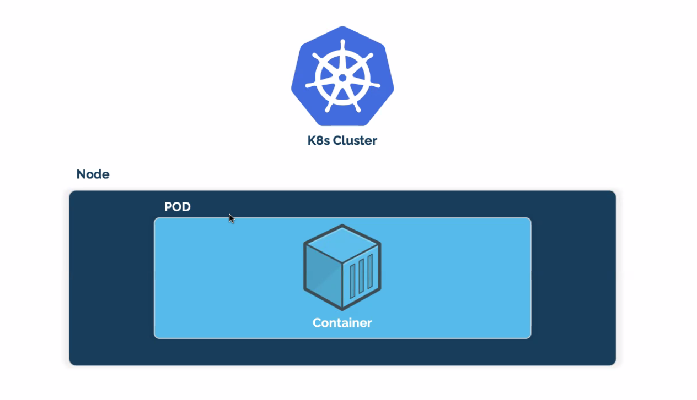
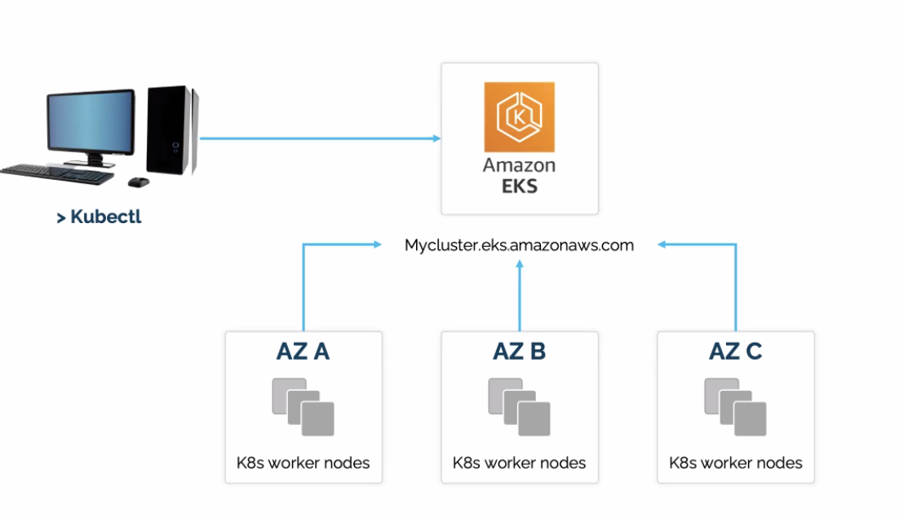
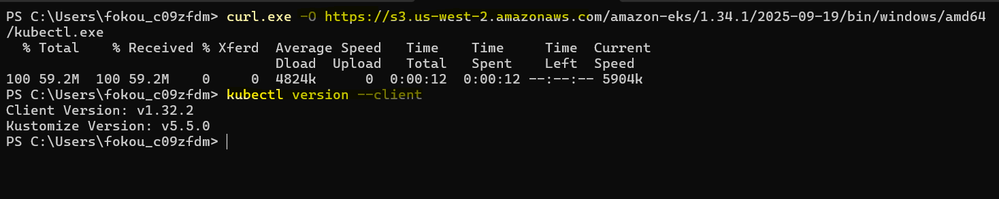
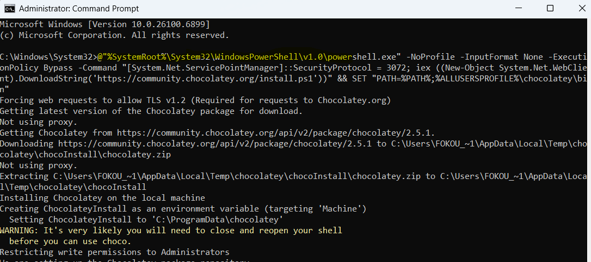
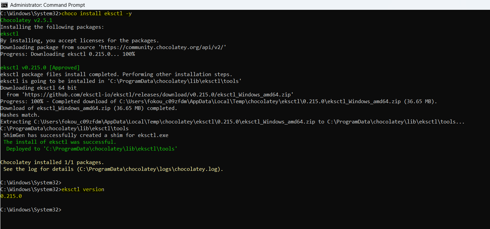
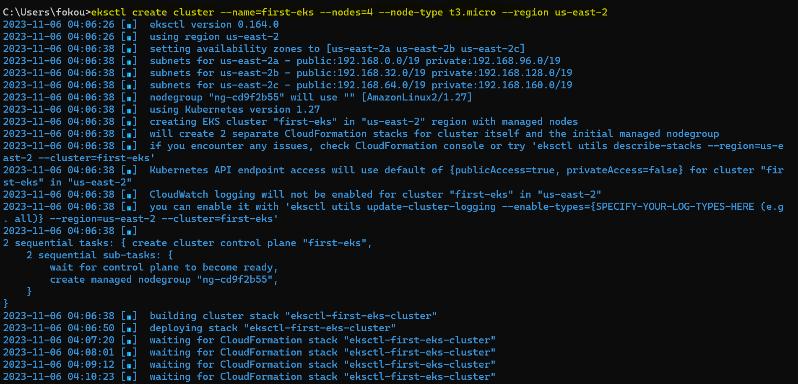
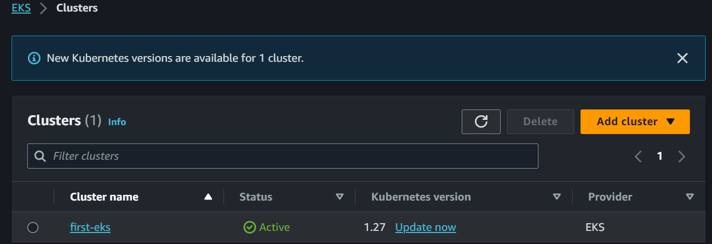
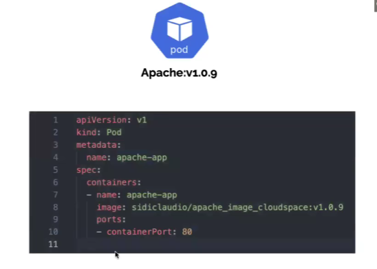

# KUBERNETES-On-AWS
This project illustrates the core architecture of a Kubernetes cluster, highlighting how the control plane and worker nodes interact to manage and orchestrate containerized applications. It demonstrates the flow of communication between key Kubernetes components such as the API Server, Scheduler, etcd, and Kubelet, forming the backbone of modern cloud-native infrastructure.

## ☸️ Kubernetes Cluster Architecture – Container Orchestration at Scale
### 📸 Project Diagram "KUBERNETES ARCHITECTURE" 


### ⚙️ Architecture Breakdown
### 🧠 Control Plane Components
- API Server: The central management point that exposes the Kubernetes API for cluster communication.
- Scheduler: Assigns newly created pods to suitable worker nodes based on resource availability and policies.
- Controller Manager (Replication Controller): Monitors the cluster state and ensures the desired number of pod replicas are running.
- etcd (Distributed Key-Value Store): Stores cluster configuration and state data in a consistent and distributed manner.

### 💻 Worker Node Components
- Kubernetes (K8s) - is an open-source system for automating deployment, scaling and management of containerized applications. (managing containers at scale N)
- When you deploy Kubernetes, you get a cluster.
- Kubernetes cluster is a group of one or more worker node consists of a set of worker machines, called nodes,that run containerized application.
- Kubelet: Agent that ensures pods are running in the node as instructed by the control plane.
- Container Runtime (Docker, containerd, etc.): Runs the containers that make up each pod.
- Kube Proxy: Maintains network rules for pod-to-pod communication and load balancing.

### 💻 CONTROL PLANE(MASTER) Components
This is the brain of kubernetes. He's responsible of sCheduling containers on the worker node. He's the guy that give direction (`ORCHESTRATION`) to each worker node. So he manages the worker nodes and the pods in the cluster.

#### `ON THE MASTER WE HAVE`
- API SERVER: It's that component in the control plane that allow or manages the comminication between the worker node and the control plane 
- ETCD (DISTRIBUTED STORAGE): As the is a communication between the Master and the Worker node there are some information that are send between them and need to be store.ETCD is just where the contole store all information about the cluster. This storage is a `key value storage`. It's a Json file. 
- SCHEDULER: It's just that component that allow the Master to know exactly where to schedule a container. He is responsible of assigning a conatiner to a node. when a worker node died, K8s will create a new one. And that new worker node doesn't conatian any POPs on it. So, the Scheduler will schedule some pops/conatiners to the new worker node. 
- REPLICATION CONTROLLER: This is the `AUTO-SCALLING FOR KUBERNETS`. The contol plane will know how to duplicate a container by using a repliacation controller. All it does is SCALLING `UP` and `DOWN OF CONATAINERS`

### 💻 WORKER NODE Components
He's the one responsible for managing the containers. That's where your containers live. - `Worker node(s)` host the PODS (containerized app). They are just Server i.e EC2 server 

#### `ON THE WORKER NODE WE HAVE`
- KUBELET: Is that engine on the worker node that make sure the containers is working as expected. The master talk to the `kubelet` to know if the worker node is UP or DOWN. The kubelet is just like the service that tell you wether the conatiner is running or not 
- CONTAINERS RUNTIME: This is just the plateform you are using on your worker node to run your container and we have been using DOCKER. It's simply installing the container DEMON into the node. There are somany conatiner runtime out there, Docker is just the most popular one
- PROXY: It's just the networking component, it function must like a `LoadBalancer` that takes the trafic and send to different containers. He is just there to handle all outside communication between the Master and the Worker node. As user we don't direvtly interact with the worker node but with the control plane and the controle plane carry that action b default. 


### 💻 POP Components
Kubernetes on it own doesn't interact directly with the containers. Kubernetes takes you conatiners and encapsulate in another object call the POP. Kubernetes then interact with the POP and the pop indirect with the conatainers.


- Pop is just one or more containers group together that share the same IP space. i.e If mutiple container are in one pop the will only have one IP address allocated to them
- It's recommented to only have one containers application inside the pop(`BEST PRACTICE`).
- Pop is the smallest objet you can create in K8s
- Pop is a k8s object that group containers. There are lot of object out the and POP is one of them 
- Pop is like your `TAGET GROUP`. The `loadbalance` interact directly with the taget group not the ec2 instance. 


A NODE can contain somany POP. Only one IP per POP. Every time you wan to scale your application your scale your pop and each POP should only have one application. So your can duplicate your applicaion to somany pop. Depending on the `INSTANCE TYPE OF YOUR APPLICATION. eg t2.micro`

### 💻 Amazon Elastic Kubernetes Service (Amazon EKS) Components
This is a managed service that you can use to run Kubernetes on AWS without needing to install, operate, and maintain your own Kubernetes control plane or nodes.



#### KUBECTL 
Is a K8s `CLI` tool that allow you to communicate with the `CONTROLE PLANE`. It's also a command line tool for provisioning Kubernetes clusters. He's not only use with EKS it's also use with K8s. Then we install `KUBECTL` by using the following steps below or by going to the official documentation Read [this page](https://docs.aws.amazon.com/eks/latest/userguide/install-kubectl.html) for more information about the syntax to use. kubectl A command line tool for working with Kubernetes clusters.

### 💻 EKSCTL Components

- EKSCTL is an open source and free tool created by Weaveworks .
- eksctl A command line tool for provisioning Kubernetes clusters.It makes the creation, deletion and management of AWS EKS Clusters SUPER EASY! 
- You will need just one command to make your AWS EKS cluster up and running, thanks to AWS CloudFormation laaC service . All you need is to do is to insert some properties (region, number of nodes, the name of your node group) and launch the creation.

### 🧩 How It Works
- The developer defines the desired application state (Pods, Deployments, Services).
- The API Server receives and validates the request.
- Scheduler assigns pods to worker nodes.
- Kubelet on each node pulls container images and runs them.
- Kube Proxy enables communication between pods and services.
- etcd stores and updates all cluster states consistently.

### 🎯 Learning Objectives
- Understand Kubernetes cluster architecture and its core components
- Learn how workloads are scheduled, deployed, and monitored
- Explore communication between the control plane and worker nodes


## 🪜 Implementation Steps Summary
### 1. Install or update kubectl. To install `KUBECTL` by using the following steps below or by going to the official documentation Read [this page](https://docs.aws.amazon.com/eks/latest/userguide/install-kubectl.html) for more information about the syntax to use.

* On macOS
```
curl -O https://s3.us-west-2.amazonaws.com/amazon-eks/1.28.2/2023-10-17/bin/darwin/amd64/kubectl

```
* On Window 
```
curl.exe -O https://s3.us-west-2.amazonaws.com/amazon-eks/1.34.1/2025-09-19/bin/windows/amd64/kubectl.exe

```
* Use the following command to verify if everything was install succesfully 
```
kubectl version --client

```


## `HOW TO INSTALL EKSCTL ON WINDOW`
### 1. We first need to install Chocolatey on CLI. Check the official documentation Read [this page](https://docs.chocolatey.org/en-us/choco/setup) for more information

* NB. Don't forget to run your CLI as `ADMINISTRATOR`
* The commad below is Install with cmd.exe
```
@"%SystemRoot%\System32\WindowsPowerShell\v1.0\powershell.exe" -NoProfile -InputFormat None -ExecutionPolicy Bypass -Command "[System.Net.ServicePointManager]::SecurityProtocol = 3072; iex ((New-Object System.Net.WebClient).DownloadString('https://community.chocolatey.org/install.ps1'))" && SET "PATH=%PATH%;%ALLUSERSPROFILE%\chocolatey\bin"

```


### 2. Then we install eksctl using `choco` 
* NB. Don't forget to run your CLI as `ADMINISTRATOR`  
```
choco install eksctl -y

```
### 3. Test that your installation was succesfull with the following command   
```
eksctl version

```


### 4. Then you need to download the `zip file` and extract it. 
* NB. Type this link to you web-browser, it will automatically download the zip file for you. 
* This link could be copy when `step 2` is done.  
```
https://github.com/eksctl-io/eksctl/releases/download/v0.164.0/eksctl_Windows_amd64.zip

```
### 5. Create your first cluster using the command below 
* NB. Before launging this command, make sure you are not working as an `ADMINISTRATOR` 
```
eksctl create cluster --name=first-eks --nodes=4 --node-type t3.micro --region us-east-2

```





## PORT MANIFEST FILE 



After doing this manifest file we will no longer going to interact with the container. This simple mince that we will no longer write the command docker pull to pull the image. Docker run for running the container. All those will know will handle by KUBERNETES. Check the official documentation Read [this page](https://kubernetes.io/docs/concepts/workloads/pods/) for more information

### 1. The first line which is `apiVersion: v1` So this is just the version of the template and it's something provided by KUBERNETES

### 2. On the seconde line we do have `kind: Pod`. Here we are telling KUBERNETES what kind of object to deployed and it's a POP 

### 3. Then we want to attache a name to our POP. We can do this by adding a `tag` to our POP. To do this you go to your `metadata section and create a name`

### 4. On the `spec` we have this element call `Containers`. 
  * `name` is the name of your container and here is `apache-app`
  * `image` here you reference your image from `dockerHub`. You just need to go to your DockerHub account an copie and existing apache image
  * `ports` then we open containerPort `80` to send and recieve traffic  

### 5. To create a pop we write the command. `NB` Change the `nginex-first-pop.yml` with the name of your yaml file. 
```
kubectl create -f .\nginex-first-pop.yml
```
### 6. This command will let you know if your pop is working. But doesn't give more information about the pop. 
```
kubectl get pod
```
### 7. This commanad is very Important. It will give you all the information about the pop 

```
kubectl describe pod nginex
```

## Author
FOKOUE THOMAS